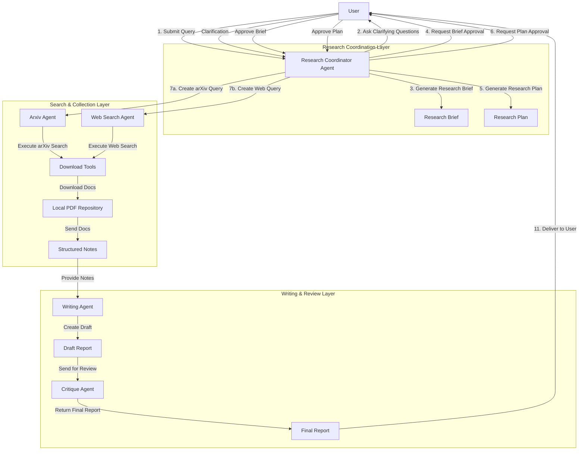
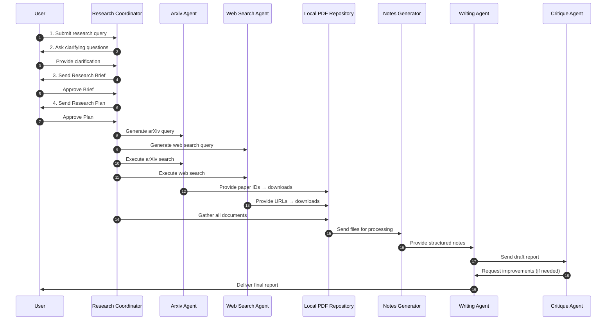

---

# Deep Research Agent Design

## Overview

### Introduction

The goal of this project is to build a **multi-agent deep research system** capable of:

* Coordinating research tasks
* Generating structured research briefs and plans
* Performing both academic and web-based searches
* Downloading and organizing source material
* Producing structured notes from documents
* Writing and reviewing a final research report

### What makes this system different?

Unlike typical research assistants, this system **automates the entire research pipeline**—from query clarification to final report generation—using a coordinated set of specialized agents and tools.

A core principle of this system is **traceability**.  
Every insight, claim, or conclusion can be traced back to its exact source segment across:

- **Web resources**
- **PDFs**
- **Academic papers**
- **Local documents**

To achieve this, the agents are designed to **highlight important sentences directly inside the source materials**. When an agent identifies a key fact, definition, or citation-worthy statement, it can:

- Automatically locate the sentence in a PDF or extracted text  
- Apply a highlight annotation  
- Record the exact location (page number, bounding box, or text index)  
- Store the highlighted snippet as an evidence pointer for downstream reasoning  

This provides a transparent, audit-ready trail from **final answer → retrieved evidence → source sentence → original document**.

By emphasizing evidence highlighting and traceability, the system enables:

- Higher reliability in generated research outputs  
- Easier verification of claims  
- Structured extraction of evidence for reports, summaries, and knowledge graphs  
- Full reproducibility of the research process

In short, this system is not just an assistant—it is a **traceable, evidence-driven research automation pipeline**, where **important sentences are highlighted directly inside the sources** to ensure accountability and transparency at every step.


---

## Pipeline

1. **User provides a query.**
2. **Research Coordinator** checks for ambiguity and asks clarifying questions.
3. Once clarified, it **generates a Research Brief** using the `generate_research_brief` tool.
4. The brief is sent to the user for approval.
5. Once approved, the coordinator creates a **Research Plan**.
6. The Research Plan is reviewed with the user for approval.
7. After approval, the coordinator:

   * Generates arXiv queries using the **Arxiv Agent**
   * Generates search queries using the **Web Search Agent**
   * Executes searches using `execute_search_main` and `execute_web_search_main`
   * Downloads papers (`download_papers`) and articles (`download_articles`)
8. The system reads documents using `read_write_notes_for_papers_in_a_directory` and produces **structured notes**.
9. A **Writing Agent** generates a draft research report based on the notes.
10. A **Critique Agent** evaluates the draft and suggests improvements.
11. The improved **Final Report** is delivered to the user.

---

# Mermaid Diagrams

## **System Architecture Flowchart**



---

## **Sequence Diagram**


## Set up

```shell
pip install -r requirements.txt
python agent.py
```
---

## TODO

| Task                                                                                                                                | Status |
|-------------------------------------------------------------------------------------------------------------------------------------|--------|
| Create a tool to download papers based on a query                                                                                   | ✅      |
| Create a placeholder tool to generate arxiv query                                                                                   | ✅      |
| Create the arxiv agent                                                                                                              | ✅      |
| Test the arxiv agent                                                                                                                | ✅      |
| Create the research coordinator agent                                                                                               | ✅      |
| Create the Todo tools for the research coordinator agent                                                                            | ✅      |
| Create the generate brief tool                                                                                                      | ✅      |
| Create the Websearch Agent                                                                                                          | ✅      |
| Implement the download code.                                                                                                        | ✅      |
| Create an agent that goes through the documents and writes notes                                                                    | ✅      |
| Create an agent that takes these notes and writes the report                                                                        | ✅      |
| Create an agent that critiques and improves the report                                                                              | ✅      |
| Migrate to pdftext to be able to use open source                                                                                    | ❌      |
| Research on better web search tools                                                                                                 | ❌      |
| Research on better way to retrieve information from documents so that it doesn't start highlighting random crap, maybe test docuglean | ❌      |
| Add the capability to search Nature papers, IEEE some promising API's are semantic API and CORE API                                 | ❌      |
| Add Summarization Capability for long conversations                                                                                 | ❌      |
| Add a section in the report that generates mermaid diagram that shows how each problem in the paper relates to sub problems         | ❌      |
| Evaluate the highlights the papers performs - come up with strategies that helps do this                                            | ❌      |
| Decouple Read Notes form write report work on fixing issues                                                                         | ❌      |
| us                                                                                                                                  |        |

---

