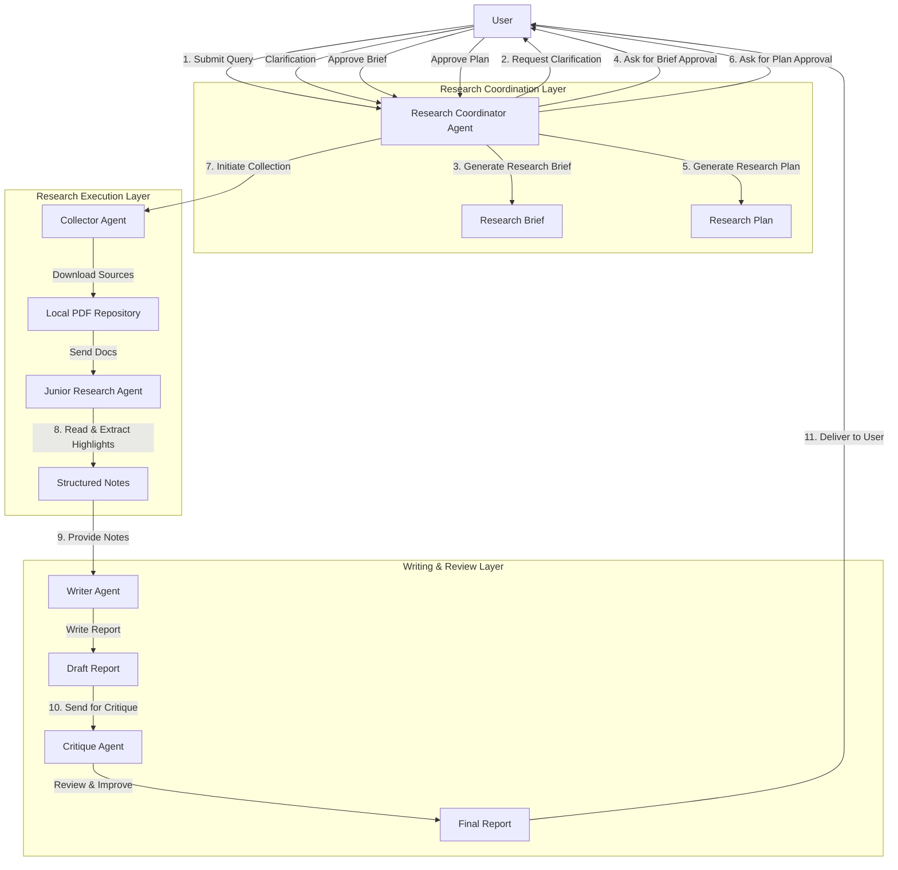
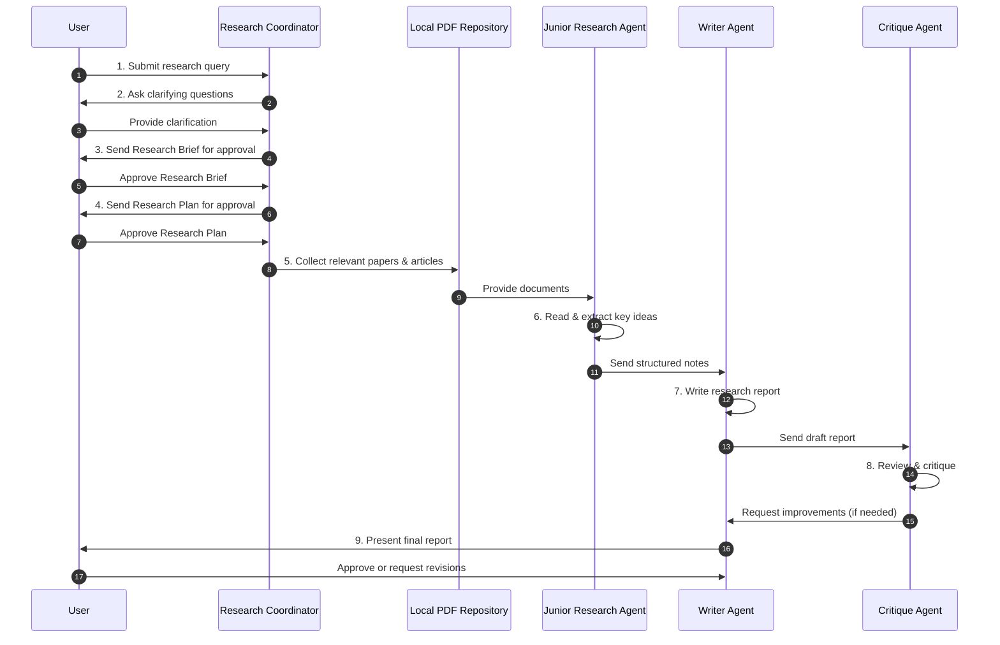

# Deep Research Agent Design

## Overview
### Introduction
The aim of this project is to create a deep research agent

### What is different about this from other deep research agent?

Provides the ability to perform research, by downloading the necessary papers and documents.

### Pipeline
1. User provides a user query.
2.  A Research Coordinator looks at the user query and first clarify what the user wants to research.
3. After we get this clarification we generate a Research Brief.
4. After generating the research brief, we ask the user to approve the research brief.
5. After the research brief is approved we develop a research plan.
6. We review the research plan with the user and get their approval.
7. After the research plan is approved, we start collecting relevant papers and articles and dump them in a pdf file in a local repository.
8. Then we get a junior research agent to read each article and web page, highlight important details and note them down.
9. Then we give these to a writer agent to write the paper.
10. Once the paper is written we get the critique agent to look at the final report and critique the report, and see if we missed anything and if possible get the research agent to make additional changes.
11. Finally, after the critique agent we present the final report to the user and ask them if they are satisfied with it or not.

## TODO
| Task                                                                               | Status |
|------------------------------------------------------------------------------------|--------|
| Create a tool to download papers based on a query                                  | ✅      |
| Create a placeholder tool to generate arxiv query                                  | ✅      |
| Create the arxiv agent                                                             | ✅      |
| Test the arxiv agent                                                               | ✅      |
| Create the research coordinator agent                                              | ✅      |
| Create the Todo tools for the research coordinator agent                           | ✅      |
| Create the generate brief tool                                                     | ✅      |
| Create the Websearch Agent                                                         | ✅      |
| Implement the download code.                                                       | ✅      |
| Create an an agent that goes through the documents and writes notes and summaries  | ❌      |
| Create an agent that takes these summaries and writes these notes.                 | ❌      |
| Create an agent that provides feedback on the report and makes appropriate changes | ❌      |
|                                                                                    |        |
